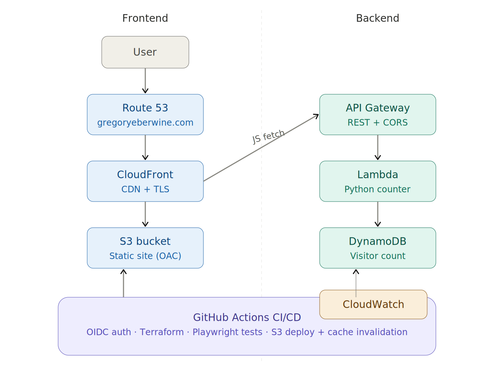

# Cloud Resume Challenge — Frontend

Static resume site for my [Cloud Resume Challenge](https://cloudresumechallenge.dev/) project. Hosted on AWS with a global CDN, custom domain, and a fully automated CI/CD pipeline that runs browser-based tests before and after every deployment.

**Live site:** [gregoryeberwine.com](https://gregoryeberwine.com)  
**Backend repo:** [resume-backend](https://github.com/gregoryeberwine/resume-backend)

---

## Architecture



The site is a private S3 bucket served exclusively through CloudFront via Origin Access Control (OAC). Route 53 routes the custom domain to the CloudFront distribution. The visitor counter API URL is injected into the HTML at deploy time from SSM Parameter Store, keeping environment-specific values out of source control.

---

## Stack

| Layer | Technology |
|---|---|
| Hosting | AWS S3 (private, static assets) |
| CDN | AWS CloudFront (TLS, global edge caching) |
| DNS | AWS Route 53 (custom domain — prod only) |
| Access Control | Origin Access Control (OAC) |
| Infrastructure | Terraform (S3 remote state) |
| CI/CD | GitHub Actions (OIDC — no stored AWS credentials) |
| Testing | Playwright (static pre-deploy + live post-deploy) |

---

## CI/CD Pipeline

Triggered on push to `main` or `dev`. Each branch targets a separate AWS environment and Terraform state bucket.

```
push → [pre_test] → [build] → [post_test]
```

1. **Pre-test** — Serves the site locally and runs Playwright static tests against `localhost`
2. **Build** — Authenticates via OIDC, injects the API URL from SSM, runs `terraform apply`, syncs files to S3, invalidates the CloudFront cache, and stores the CloudFront URL back in SSM for the backend's CORS configuration
3. **Post-test** — Runs Playwright live tests against the deployed URL (CloudFront in dev, `gregoryeberwine.com` in prod)

Playwright browser binaries are cached between runs. Trace artifacts are uploaded on test failure for debugging.

---

## Test Suite

### Static tests (`test_static.py`) — run pre-deploy against a local server

| Test | What it verifies |
|---|---|
| `test_has_title` | Page title contains "Resume" |
| `test_name_heading` | Full name appears as the H1 heading |
| `test_email_link` | Email link points to the correct address |
| `test_github_link` | GitHub link points to the correct profile URL |
| `test_linkedin_link` | LinkedIn link points to the correct profile URL |
| `test_contact_has_phone_number` | Contact section contains a formatted phone number |
| `test_has_summary_section` | Summary section heading is visible |
| `test_has_experience_section` | Experience section heading is visible |
| `test_has_certifications_section` | Certifications section heading is visible |
| `test_has_skills_section` | Technical Skills section heading is visible |
| `test_has_education_section` | Education section heading is visible |
| `test_visitor_counter_element_exists` | Visitor counter element is present in the DOM |

### Live tests (`test_live.py`) — run post-deploy against the real URL

| Test | What it verifies |
|---|---|
| `test_counter_number` | Visitor counter displays a numeric value after page load |
| `test_counter_increments` | Counter value increases between consecutive page loads |

---

## Repo Structure

```
├── .github/workflows/   # GitHub Actions CI/CD (test → build → test)
├── site/                # HTML and CSS source files
├── terraform/           # All AWS infrastructure as code
├── tests/               # Playwright test suite (static and live)
└── requirements.txt     # Python dependencies (Playwright, pytest)
```

---

## What I Learned

For most of the project, I had a lot of trouble getting the end to end deployment to work because I had registered my domain through Route 53 in my management account instead of the dev and prod accounts I was working out of. I'd registered the domain before I'd decided to use multiple accounts, unfortunately. This made it really difficult as I needed to change the DNS records for both the cloudfront distribution it would point to, and handle validating the TLS certificate. I ended up using an IAM role assumed cross account to handle both though, and it ended up being more straightforward than I was dreading!